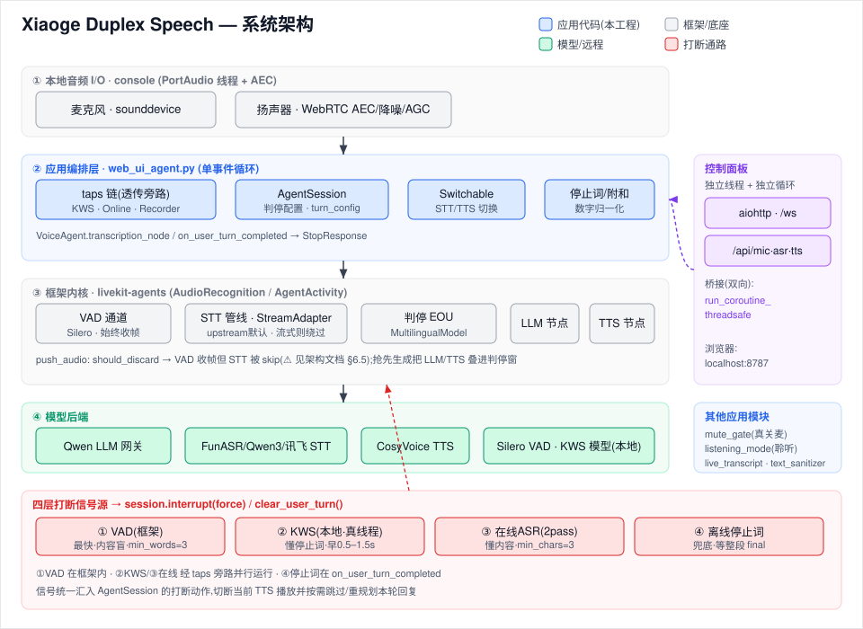
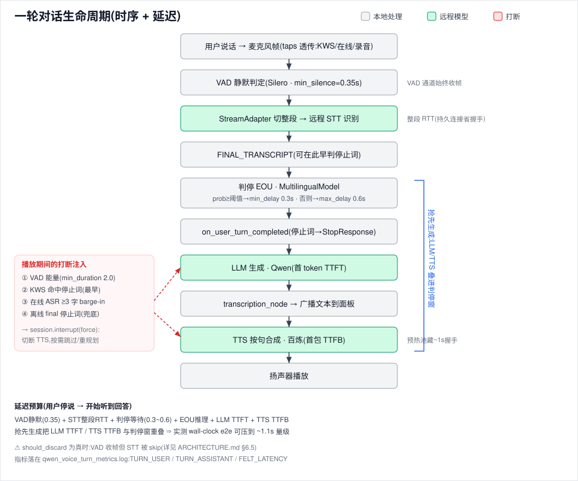

# Xiaoge Duplex Speech — 工程架构分析

> 面向二次开发的系统架构说明。读者:软件架构师。
> 入口应用:`examples/voice_agents/web_ui_agent.py`(console 模式 + 浏览器测试面板)。
> 框架底座:LiveKit Agents(`livekit-agents/`)的二次开发 fork。
> 配套文档:源码级导读见 `examples/voice_agents/qwen_voice_agent_code_guide.md`(注:其中部分阈值是“本应用覆盖值”,不是框架默认值,见本文 §10 的对照表)。

> 注:文中 `文件:行号` 为撰写时快照,代码已演进,**以符号名/当前代码为准**。

---

## 1. 项目定位与能力

一个**全双工中文语音交互引擎**(小歌):用户说话与引擎应答可同时进行,支持随时打断、即时反应。它把 LiveKit Agents 框架当作“语音对话编排内核”,在其上接入**自建/第三方的远程模型**并叠加**多层打断机制**与**可视化测试面板**。

**技术栈(可运行时切换的部分用 ⇄ 标注):**

| 能力 | 实现 | 后端 |
| --- | --- | --- |
| LLM | `livekit.plugins.openai.LLM`(OpenAI 兼容) | Qwen3-4B 网关(自建) |
| STT | 随 `XIAOGE_STACK` 装配:`upstream`(默认)→ 离线 FunASR 经 `StreamAdapter` + Silero VAD 切片(可热切换 ⇄);`optimized` → `funasr-stream`(FunASR 2pass 流式,**不过 StreamAdapter**) | FunASR 离线(默认)/ FunASR 流式 / Qwen3-ASR / Qwen3-流式 / 讯飞 RTASR(`STT_BACKEND=iflytek`) |
| TTS ⇄ | 自定义 `TTS`(流式) | CosyVoice DashScope `cosyvoice-v3-flash`(**默认**)/ 百炼 `qwen-tts-realtime` / HTTP-TTS |
| VAD | `livekit.plugins.silero` | 本地 ONNX |
| 判停(EOU) | `livekit.plugins.turn_detector.MultilingualModel` | 本地 ONNX(独立推理进程) |
| 强打断 KWS | `examples/voice_agents/kws_interrupt.py` | sherpa-onnx(本地,`models/kws/`) |
| 早打断 | `examples/voice_agents/online_interrupt.py` | FunASR 2pass 并行流 |
| 录音 | `examples/voice_agents/audio_recorder.py` | 本地 WAV |
| 控制面板 | 内嵌 aiohttp + WebSocket | 浏览器 `http://localhost:8787`(`start.ps1`/`.env` 的 `WEB_UI_PORT`,被占用自动顺延;直接跑 `web_ui_agent.py` 无该 env 时代码回退 8765) |

---

## 2. 系统架构总览



分四层:**本地音频 I/O → 框架编排内核 → 应用编排层(小歌) → 远程模型/控制面**。

```
┌──────────────────────────────────────────────────────────────────────────────┐
│  本地 I/O (console, cli.py)   麦克风 ──sounddevice(PortAudio线程)──┐          │
│                               扬声器 ◄─sounddevice + WebRTC AEC ──┐ │          │
└───────────────────────────────────────────────────────────────┼─┼──────────┘
            call_soon_threadsafe ▲ (跨线程入事件循环)             │ │
┌───────────────────────────────┴───────────────────────────────┼─┼──────────┐
│  应用编排层 (web_ui_agent.py, 单事件循环)                        │ │          │
│                                                                 ▼ │          │
│  session.input.audio ──► [KWS tap] ──► [Online tap] ──► [Recorder tap] ──┐   │
│        (taps 链:每个包住前一个,旁路观测后原样透传)                       │   │
│                                                                          ▼   │
│  AgentSession ── AudioRecognition ──┬─► VAD(Silero)──► 判停(EOU)             │
│     │                               └─► STT 管线:                            │
│     │                                  upstream(默认)→ StreamAdapter(自带VAD切片)→ SwitchableSTT ⇄ 远程ASR│
│     │                                  optimized → funasr-stream(流式,绕过 StreamAdapter)│
│     ├─ on_user_turn_completed:停止词/附和/数字归一化 → StopResponse           │
│     ├─ LLM(Qwen) ─► transcription_node(广播文本)─► tts_node(去markdown)─► TTS(默认CosyVoice)─► output.audio│
│     └─ 事件:agent_state/user_state/transcribed/item_added → 指标&广播         │
│                                                                              │
│  打断信号源:  KWS.on_hit ──┐  Online.on_text ──┐  停止词(offline final)──┐   │
│               session.interrupt(force) ◄────────┴──────────────────────────┘   │
└────────────────────────────────────────────────────────────────────────────┘
        ▲ run_coroutine_threadsafe(双向跨循环)
┌───────┴──────────────────────────────────────────────────────────────────────┐
│  控制面板 (独立线程 + 独立事件循环, aiohttp)                                    │
│  GET / (HTML)  GET /ws (实时日志/状态)  POST /api/{mic,asr,tts}                 │
└────────────────────────────────────────────────────────────────────────────┘
```

**关键设计取向**
- 应用逻辑全部跑在**一个 asyncio 事件循环**(job loop)上;一切阻塞操作(DashScope SDK、sherpa 解码、WAV 落盘)都被推到**真线程**,再用 `call_soon_threadsafe` / `run_coroutine_threadsafe` 桥回。
- 远程模型通过**自定义 `STT`/`TTS`/`LLM` 适配器**接入,框架对它们只认 `capabilities`(能力探测)接口,因此后端可热插拔。
- 打断是本工程的核心特色:**4 条互补的打断通路**(见 §6),覆盖“快但盲(VAD)/快且懂命令(KWS)/懂内容(在线 ASR)/兜底(离线文本)”的不同权衡。

---

## 3. 运行时与进程模型

### 3.1 框架对象
- **`AgentServer`**(`worker.py:295`,旧称 Worker):调度器,不跑 agent 代码本身。`server.setup_fnc = prewarm` 注册预热;`@server.rtc_session()` 注册每会话入口。
- **`prewarm(proc)`**(`web_ui_agent.py:834`):每个 job 进程**仅执行一次**,把昂贵的 Silero VAD(`min_silence_duration=0.35`)装进 `proc.userdata["vad"]`,跨 job 复用。
- **`JobContext`**(`job.py:153`):提供 `ctx.room`、`ctx.proc`、`ctx.add_shutdown_callback` 等;入口 `entrypoint(ctx)` 在此基础上构建 `AgentSession`。

### 3.2 console 模式(本工程的实际运行方式)
`python web_ui_agent.py console` → `cli/cli.py:_run_console`:
- 用 **`ThreadJobExecutor`**(不是子进程),job 跑在**进程内一条专用线程**上,有自己的事件循环;主线程跑 Rich UI。预热照常执行。
- 注入一个 `fake_job`(mock room,无 WebRTC),`server.run(devmode=True, unregistered=True)`——不向 LiveKit 注册。
- **本地音频**:`ConsoleAudioInput/Output`(`cli.py:109/132`)用 sounddevice;采集/播放回调跑在 **PortAudio 线程**,经 `call_soon_threadsafe` 入事件循环。**console 模式自带 WebRTC AEC**(`AudioProcessingModule`,回声消除/降噪/AGC,`cli.py:325`)——生产 room 模式没有这个免费 AEC。

> 结论:console 下进程内其实有**多条线程/循环**(UI 主线程、server 线程、job 线程、PortAudio 线程、各 SDK 线程),并非单循环。理解这点对调试跨线程问题至关重要。

### 3.3 线程 vs 事件循环全景

| 角色 | 载体 | 入循环的桥 |
| --- | --- | --- |
| 应用编排 / 网络 STT / 在线打断 | job 事件循环(asyncio task) | — |
| 麦克风/扬声器回调 | PortAudio 线程 | `loop.call_soon_threadsafe` |
| KWS 解码(sherpa,CPU 密集) | 专用 daemon 线程 + `queue.Queue` | `loop.call_soon_threadsafe(on_hit)` |
| 百炼 TTS(DashScope 同步 SDK) | SDK 自带 WS 线程;调用经 `asyncio.to_thread` | `queue.Queue` + `threading.Event` |
| 判停 EOU(ONNX) | 独立推理 executor 进程 | 框架内部 |
| 录音落盘 | `asyncio.to_thread`(close 时) | `threading.Lock` 保护缓冲 |
| 控制面板 | 独立线程 + 独立事件循环 | `run_coroutine_threadsafe`(双向) |

---

## 4. 主要模块详解(应用层)

> 行号以本次分析时为准,会随代码漂移;漂了按符号名搜索。

### 4.1 `web_ui_agent.py` —— 应用心脏
职责:构建会话、接后端、装打断 tap、跑控制面板、采集指标。

- **入口流程**(`@server.rtc_session()` `:841`):捕获 `_agent_loop` → `build_stt/tts/llm` → 构建 `AgentSession`(`:861`)→ 注册 6 个事件处理器 → `_warmup_llm()` 火忘任务 → `await session.start(VoiceAgent(), room)` → **start 之后**依次装 `AudioRecorder`、KWS tap、Online tap(`:976-1041`)。
- **`AgentSession` 配置**(本应用生效值;判停旋钮统一来自 `turn_config.py` 的 `TurnConfig.from_env()`,`TURN_*` 环境变量可覆盖):
  | 项 | 值 | 含义 |
  | --- | --- | --- |
  | `turn_detection` | `MultilingualModel(unlikely_threshold=…)` | 语义判停(多语);阈值默认 None(用模型默认) |
  | `interruption` | `min_words=3, min_duration=2.0, backchannel_boundary=(1.8,3.5)` | 打断需达 3 词/2s;1.8–3.5s 视作附和 |
  | `endpointing` | `min_delay=0.3, max_delay=0.6` | 判停静默等待区间(很紧,为低延迟) |
  | `preemptive_generation` | `preemptive_tts=True` | 抢先生成 LLM+TTS,叠到判停窗里省延迟 |
- **`VoiceAgent`**:系统提示要求简短、不用 markdown、数字逐位读、命中停止词则沉默。重写了**两个**节点:**`transcription_node`** 把 LLM 文本流“偷看”一份,生成一结束就 `strip_markdown` 后 `broadcast` 给浏览器(早于 TTS 播完);**`tts_node`** 在合成前对文本流跑 `sanitize_stream`(去 markdown/符号),避免 TTS 把 `**`/`###`/`→` 读出来。`on_user_turn_completed` 做停止词/附和/抢说过滤 + 数字归一化(详见 §6.4)。另外 entrypoint 在所有 tap 装好后用 `session.say(...)` 播固定开场白。
- **`build_llm()`**(`:742`):裸 `openai.AsyncClient`(`max_retries=0`,自调 httpx 超时 15/30/30、50 连接池),`Qwen3-4B`,`temp0.7/top_p0.9/top_k20/max_tokens512/presence_penalty1.5`,`enable_thinking=False`(关 Qwen3 思考模式降延迟)。SSL 默认不校验。
- **`SwitchableSTT`/`SwitchableTTS`**:见 §7。
- **控制面板**:见 §8。
- **指标日志**:见 §10.3。

### 4.2 `custom_audio_providers.py` —— 远程模型适配器
实现多类 Provider,统一服从框架 `STT`/`TTS` 抽象(`_recognize_impl` / `synthesize`+`stream` / `capabilities` / `provider`)。

- **`FunASROfflineSTT`**(`:89`,默认 STT):离线模式 WS。**持久连接复用**(省 ~190ms/turn)+ `asyncio.Lock` 串行化;握手 JSON(`mode:offline / chunk_size / audio_fs / is_speaking / hotwords / itn`),全速上传 PCM,发 `{is_speaking:false}` 触发识别,收 `text`/`is_final`;超时未拿到 final 则 `_reset_ws` 防“串台”。连接超时 `_WS_CONNECT_TIMEOUT`(5s,`asyncio.wait_for`)。失败重连重试一次。
- **`Qwen3ASROfflineSTT` / `_Qwen3StreamSTT`**(`:277`/`:687`):growing-buffer WS,无握手,发 `{action:finalize}`,取最后的 `full_text`。**预热连接**机制(`prewarm_connection`/`_warm_ws`):用户一开口就提前建连,把握手延迟藏进说话窗;无锁(靠 asyncio 单线程原子性),且**预热未完成不阻塞识别**(直接开新连)。**每轮一条连接**(与 FunASR 的持久复用相反)。
- **`FunASRStreamingSTT`(2pass)**(`:466`):`streaming=True, interim_results=True`,发 interim(2pass-online)+ final(2pass-offline);剥前导标点避免判停拖到 `max_delay`。
- **`CosyVoiceStreamingTTS`(DashScope CosyVoice,**默认 TTS**)**:默认 `model=cosyvoice-v3-flash`、`voice=longxiaochun_v3`(`COSYVOICE_MODEL`/`COSYVOICE_VOICE` 可覆盖);DashScope SDK 流式合成,与 `QwenStreamingTTS` 同属 DashScope 系。
- **`QwenStreamingTTS`(百炼,可选)**:DashScope 同步 SDK 包进 `to_thread`;**每轮一条连接**(connect/update_session → 逐句 append_text → finish/close),打断即 `close()` 中止服务端合成。**size-1 预热连接池**(`threading.Lock`,TTL 20s)把 ~1s 握手藏到上一轮播放期;**按句边界增量合成**(首包延迟从“整段”降到“首句”)。
- **`HttpStreamingTTS`(可选)**:流式 HTTP POST(`audio/L16`,24kHz),逐句 POST。
- TTS 后端集合 = `{cosyvoice, qwen, http}`(`TTS_BACKEND` 默认 `cosyvoice`)。
- 通用:重采样(ASR 16kHz、TTS 24kHz 单声道 16bit;`rtc.AudioResampler`)。已抽公共 `_resample_pcm()` / `_acquire_http_session()`(A 档去重);DashScope `api_key` 是**进程级全局**(已加注释,单 key 场景 OK)。

### 4.3 `kws_interrupt.py` —— 本地关键词强打断
- **`KwsConfig.from_env()`**:`XIAOGE_KWS_ENABLE_NATIVE` 默认 **1**(开),`XIAOGE_KWS_MODEL_DIR` 默认指向 `<repo>/models/kws/sherpa-onnx-kws-zipformer-zh-en-3M-2025-12-20`(按 `__file__` 的 `parents[2]` 定位,不依赖 cwd)。
- **`NativeKwsSpotter`**:sherpa-onnx `KeywordSpotter`。**解码跑真线程**,`push()` 只做非阻塞入队(队满丢最旧),命中经 `call_soon_threadsafe(on_hit, keyword)` 桥回循环;800ms 去抖。关键词需转**拼音音素 token**(pypinyin INITIALS+FINALS_TONE,`d ing2 ... @停下`)。
- **`KwsTapAudioInput`**:tap,`__anext__` 取帧→喂 spotter→**原样透传**。
- **优雅降级**:缺 sherpa/numpy/pypinyin/模型 → `_unavailable_reason` 返回原因,no-op,不阻塞启动。
- **命中动作不在本模块**:`on_hit` 回调(在 `web_ui_agent.py` 里)执行 `session.interrupt(force=True)`。

### 4.4 `online_interrupt.py` —— 在线 ASR 早打断
- 第二条**并行** FunASR 2pass WS,只为“在 AI 说话时数用户说了多少字”做 barge-in 判定(转写内容不进对话)。
- **全程 asyncio**(无线程):`asyncio.Queue` + `create_task`;`chunk_size:[5,8,4]`(480ms,比主链路更短以降首包);reconnect-only,异常全吞。
- `on_text(text, segment_end)`:online 增量 → 上层累计;offline → 清累计避免重复计数。**判定阈值 `min_chars=3` 在 config,策略在 agent 文件**。
- `OnlineTapAudioInput`:同 KWS 的 tap 模式。

### 4.5 `audio_recorder.py` —— 会话录音
- 同样用 tap:`RecordingTapAudioInput`(麦克风)+ `RecordingTapAudioOutput`(TTS,`next_in_chain`,**先转发再观测**,且转发 `flush`/`clear_buffer` 以不破坏打断语义)。
- 以**麦克风帧为时间轴**,把 TTS 帧缓冲后混音写入 `recordings/<时间戳>/conversation.wav`(16kHz 单声道,int16 加和裁剪)。`close` 经 `to_thread`,缓冲有 `threading.Lock`。

### 4.6 其余应用模块(按职责)
- **`funasr_stream_stt.py`** —— **流式主 STT**(`FunASRStreamSTT`):FunASR 2pass 流式,内置独立 silero VAD + GAP 聚合,**不过 StreamAdapter**;`XIAOGE_STACK=optimized`(或 `STT_BACKEND=funasr-stream`)时启用,`_switchable_stt=None`(面板 ASR 热切换不适用,需重启切换)。
- **`iflytek_stt.py`** —— 讯飞 RTASR(`IFlyTekRTASR`),`STT_BACKEND=iflytek` 启用的可选第三方流式 STT(同样绕过 StreamAdapter)。
- **`listening_mode.py`** —— 聆听模式控制器(`ListeningController`,纯状态机):唤醒词进入/退出、临时内容 TTL、退出尾巴 final 处理等(host 助手在 agent 循环线程串行执行)。
- **`mute_gate.py`** —— **真关麦**(`MuteGate`):包住 `session.input.audio`,在输入**源头**静音,对**所有** STT 后端统一生效。这是关麦的**主机制**(见 §7/§8)。
- **`live_transcript.py`** —— Web 实时转写气泡(`LiveTranscript`/`LiveTranscriptConfig`):驱动浏览器“聆听中”live 气泡(开口出现、partial 边长、final 定稿)。
- **`text_sanitizer.py`** —— `sanitize_stream` / `strip_markdown`:净化 `tts_node`(合成前去 markdown/符号)与 `transcription_node`(气泡显示纯口语)。
- **`turn_config.py`** —— `TurnConfig`:判停旋钮(VAD 静音、endpointing、打断阈值、抢跑、`unlikely_threshold`)集中一处,`TURN_*` 环境变量可覆盖,默认 = 原写死值(见 §10.4)。

---

## 5. 核心流程:一轮对话的完整生命周期



```
麦克风帧
  └─►(taps 透传:KWS/Online/Recorder 旁路观测)
     └─► AgentSession._forward_audio_task → AgentActivity.push_audio
          │  计算 should_discard(见 §6.5);否则 skip_stt=False
          └─► AudioRecognition.push_audio(frame, skip_stt)
               ├─►(总是)VAD 通道:Silero VAD → START/END_OF_SPEECH → 用户状态/判停触发
               └─►(除非 skip_stt)STT 管线:_STTPipeline → stt_node
                     └─► StreamAdapter(对非流式 STT):用“自己的”VAD 把音频切成整段
                            └─► 整段 await SwitchableSTT.recognize() → FINAL_TRANSCRIPT
  FINAL_TRANSCRIPT
   └─► AudioRecognition._on_stt_event:累计 transcript;(本应用 VAD-based)触发抢先生成 + 判停
        └─► 判停 EOU:MultilingualModel.predict_end_of_turn(prob, unlikely_threshold)
              prob≥阈值 → endpointing=min_delay(0.3) ; 否则 → max_delay(0.6)
              等待锚定“最后一帧语音”(已过的静默被抵扣)
   └─► on_end_of_turn → Agent.on_user_turn_completed(停止词/附和→StopResponse;否则数字归一化)
        └─► _generate_reply:llm_node(Qwen 流式)→ transcription_node(广播文本)
              → tts_node(去 markdown → 默认 CosyVoice 流式)→ output.audio → 扬声器
```
> 上图是 `upstream`(默认)装配:离线 STT 经 `StreamAdapter` 整段识别。`optimized`(`funasr-stream`)/讯飞为流式 STT,**绕过 StreamAdapter**(自带 VAD/聚合),无“等整段”这一结构性延迟。

**几个易被忽略的点**
- **两个 VAD 实例**跑在同一份音频上:一个给 `AudioRecognition`(用户状态/打断/判停),一个在 `StreamAdapter` 内部(把音频切成整段喂离线 STT)。
- 非流式 STT **必须等整段说完**才能识别(`StreamAdapter` 等 VAD 的 END_OF_SPEECH);这是延迟的结构性来源。
- **抢先生成(preemptive)**:在 final/preflight transcript 上就启动 LLM(及 TTS),把判停+EOU 的等待窗与 LLM 首 token / TTS 首包**重叠**;若最终提交的 turn 变了(如 `on_user_turn_completed` 改写了消息),抢先成果作废。

---

## 6. 全双工打断机制(本工程的核心)

四条互补通路,从“最快最盲”到“最慢最稳”:

| 层 | 来源 | 运行处 | 触发条件 | 相对延迟 | 失败行为 |
| --- | --- | --- | --- | --- | --- |
| ① VAD 打断 | 框架内置 | 事件循环 | 语音能量 + `min_duration=2.0` 且 `min_words≥3` | 最低但**内容盲** | 核心,不失效 |
| ② KWS 强打断 | `kws_interrupt.py`(本地 sherpa) | **真线程** | 命中停止词(停/别说了/等等…) | 比离线 STT final **早 0.5–1.5s**,无网络 | 缺模型/依赖→no-op |
| ③ 在线 ASR 早打断 | `online_interrupt.py`(FunASR 2pass) | asyncio task | AI 说话时识别到 ≥`min_chars=3` 字;停止词→强打断 | 早于离线 final,慢于 KWS | reconnect-only |
| ④ 离线文本兜底 | 停止词表 + `on_user_turn_completed` | 事件循环 | 离线 STT final 命中停止词/附和 | 最慢(等整段) | 始终可用 |

### 6.1 ②KWS:`on_hit` → `session.interrupt(force=True)`(`web_ui_agent.py:982-998`),日志 `STOP_KWS_EARLY`。
### 6.2 ③在线:`_on_online_text`(`:1003-1029`)仅在 `agent_state=="speaking"` 时动作,1s 限频;停止词→`interrupt(force=True)`(`STOP_ONLINE_EARLY`),否则达 `min_chars`→软 `interrupt()`(`OVERLAP_ONLINE_INTERRUPT`)。
### 6.3 ④离线/早判:`user_input_transcribed` 处理器(`:944`)在 final 上可提前 `interrupt(force=True)`(`STOP_PHRASE_EARLY`)或 `clear_user_turn()`(附和重叠)。
### 6.4 停止词语义(`:94-170`):`_STOP_WORDS` + 允许引导词(那/你/就…)+ 尾词(一下/吧/呢…)的正则;`on_user_turn_completed` 决策序:停止词→`interrupt(force)`+`raise StopResponse`;附和→`StopResponse`;抢说+附和→`StopResponse`;否则把纯数字串改写成“1、2、3”逐位读。
### 6.5 ⚠️ 打断的“暗面”——音频丢弃(本会话实际踩过的坑)
`AgentActivity.push_audio`(`agent_activity.py:1012`)计算
`should_discard = aec_warmup_active OR uninterruptible_speech_active`,为真时 **VAD 照常收帧、但 STT 被 `skip_stt` 跳过**(`:1036` 注释明确)。后果:**VAD 显示“用户在说话”,但根本没送去识别**。当某个 speech handle 卡在未完成/状态卡在 speaking,会出现“能听到问候、用户说话却不识别”的现象。`discard_audio_if_uninterruptible` 默认 True;AEC 预热默认 3s。二次开发改打断/状态机时务必注意这条。

> tap 的承载式不变量:任何 input tap 的 `__anext__` 若没把帧 `return`(异常逃逸/被过滤),**下游整条 STT/VAD 会断粮、agent 变聋**;output tap 必须转发 `clear_buffer`/`flush` 否则打断切不断播放。

---

## 7. STT/TTS 可切换后端架构

- **`SwitchableSTT`/`SwitchableTTS`** 是代理:`AgentSession`/`StreamAdapter` 持有代理引用,`switch_backend()` 原子换内部 `_backend`(GIL 安全),**下一句生效**,无需重启会话/适配器。旧后端 `aclose()` 在 agent 循环上**火忘**执行。⚠️ **仅 `upstream`(离线 + StreamAdapter)装配下面板 ASR 热切换可用**;流式后端(`funasr-stream`/讯飞)`_switchable_stt=None`、不经 SwitchableSTT,**面板 ASR 热切换不可用**,切后端需重启。TTS 热切换不受此限。
- **关麦 = MuteGate(主机制)**:关麦的**主**实现是 `mute_gate.MuteGate`——它包住 `session.input.audio`,在输入**源头**静音,对**所有** STT 后端(含流式/讯飞,不经 SwitchableSTT 的也包含在内)统一生效=**真关麦**。面板 `/api/mic` 翻转 `_mute_gate.muted`。`SwitchableSTT.muted`(muted 时 `_recognize_impl` 直接返回空 FINAL transcript)只是**冗余同步**保持状态一致,流式后端根本不经过它。
- **失败不致命(本会话新增)**:`SwitchableSTT._recognize_impl` 用 `try/except` 包住后端调用,**异常→返回空**而不是抛出。原因:抛出会**杀死 `StreamAdapter` 的识别流**,导致即便切回也永久变聋。这样切到不可达后端最多“暂时没反应”,切回即恢复。✅ **`SwitchableTTS` 已有对称保护**(B 档):把后端 TTS 的 `error` 事件转发到代理,框架的“可恢复错误→记录并继续”逻辑生效;`HttpStreamingTTS` POST 加了连接超时(`TTS_CONNECT_TIMEOUT`,默认 5s),切到不可达 TTS 也是快速失败、切回即恢复,不崩。
- **连接超时**:`_WS_CONNECT_TIMEOUT=5s` 让不可达后端快速失败(否则 Windows 上 TCP 连接卡 ~21s)。
- **加新后端**(A 档后已简化):构造逻辑收敛到 `_make_stt_backend()` / `_make_tts_backend()` **单一来源**(`build_*` 与 `/api/{asr,tts}` 切换共用)。加后端只需:在该工厂加分支、把 key 加进 `_STT_BACKENDS`/`_TTS_BACKENDS`、再加 `_HTML` 里的 tab。

---

## 8. Web 控制面板架构

- **独立线程 + 独立事件循环**:`__main__` 起 daemon 线程跑 `asyncio.run(_run_web_server)`;两个全局桥 `_web_loop`(web 循环)、`_agent_loop`(agent 循环)。
- **路由**:`GET /`(内嵌 HTML)、`GET /ws`(实时日志/状态,5s 自动重连)、`POST /api/mic|asr|tts`。
- **跨循环纪律**:
  - agent→web:`broadcast()` 用 `run_coroutine_threadsafe(_ws_broadcast, _web_loop)`(转写、状态)。
  - web→agent:切后端时旧后端 `aclose()` 用 `run_coroutine_threadsafe(old.aclose(), _agent_loop)`(必须在后端所属循环销毁)。
  - **绝不**在 web 处理器里直接 `await` agent 侧协程。
- 面板是“监视 + 控制”,**对话靠语音**(没有文字输入框);点麦克风按钮是**切换静音**(易误解为“开麦”)。

---

## 9. 并发模型与线程桥接

见 §3.3 全景表。核心原则:**循环上只做最少的事,重活下真线程,跨界只走 `call_soon_threadsafe`(线程→循环)/`run_coroutine_threadsafe`(循环→另一循环)**。
- KWS = 真线程(CPU 解码)+ 队列丢最旧 backpressure。
- 在线打断 = 纯 asyncio。
- 百炼 TTS = 同步 SDK(`to_thread`)+ SDK 自带 WS 线程(`queue.Queue`+`Event`)+ 预热池(`threading.Lock`)。
- 判停 EOU = 独立推理进程。
- console 音频 = PortAudio 线程 + AEC。

---

## 10. 性能特征与延迟预算

### 10.1 一轮延迟构成(用户停说→开始听到回答)
```
VAD 静默判定(min_silence_duration=0.35)
  + 离线 STT 整段识别 RTT(持久连接省握手)
  + 判停等待(endpointing 0.3 快 / 0.6 慢,锚定最后语音帧,已过静默被抵扣)
  + EOU ONNX 推理(并发在等待窗内)
  + LLM 首 token(TTFT)
  + TTS 首包(TTFB)
  └─ 抢先生成把 LLM TTFT / TTS TTFB 与判停窗重叠 ⇒ 实测 wall-clock e2e 可压到 ~1.1s 量级
```

### 10.2 已落地的性能手段
- FunASR **持久 WS 复用**(~190ms/turn);Qwen3-ASR **预热连接**(藏握手,且不阻塞识别)。
- 百炼 TTS **预热连接池**(藏 ~1s 握手,TTL 20s 防半死连接)+ **按句增量合成**(首包=首句)。
- FunASR 2pass **剥前导标点**(避免判停拖到 max_delay);离线 **全速上传**(不拖“说完”信号)。
- LLM 关思考模式、`max_retries=0`、自调连接池/超时。
- 在线打断用更短 `chunk_size`(480ms)换更早 barge-in。

### 10.3 可观测性
- `qwen_voice_turn_metrics.log`:`TURN_USER`(transcription_delay/end_of_turn_delay…)、`TURN_ASSISTANT`(llm_ttft/tts_ttfb/playback_latency/e2e_latency/wall_clock_e2e)、`FELT_LATENCY`(用户停说→开口的体感延迟)。仍在。
- **`.run/agent.log` 已废除**:正常运行**不再写任何文件日志处理器**(零开销)。DEBUG 全量日志(VAD/STT/KWS/dashscope)改由测试模式承载——设 `AGENT_TIMELINE=1` 时写 `runs/<时间戳>/debug.log`(见 `event_timeline.install_debug_log`);设 `LIVEKIT_LOG_LEVEL=DEBUG` 更详。

### 10.4 ⚠️ 重要:阈值的“本应用值” vs “框架默认值”
源码导读里的若干数字其实是**本应用在 `turn_handling` 里覆盖的值**,不是框架默认值:

| 项 | 本应用生效值 | 框架默认值(`endpointing.py`) |
| --- | --- | --- |
| `endpointing.min_delay/max_delay` | 0.3 / 0.6 | 0.5 / 3.0 |
| `interruption.min_words` | 3 | 0 |
| `interruption.min_duration` | 2.0 | 1.2 |
| `preemptive_tts` | True | False |
| Silero `min_silence_duration` | 0.35 | 插件层设定 |

调优时改 `turn_config.py` 的 `TurnConfig`(或设对应 `TURN_*` 环境变量)即可,不必动框架,也不必改 `web_ui_agent.py`。默认值不变。

---

## 11. 配置体系

- **唯一配置文件 = 根目录 `.env`**(`python-dotenv` + `start.ps1` 自动加载注入进程环境)。清单见 `.env.example`。无 `config/` 目录(单应用 MVP 不需要)。
- 代码里每个 `os.getenv("X", 默认)` 都带内置默认,`.env` 缺项也能跑。
- 关键变量:`QWEN_*`(LLM)、`XIAOGE_STACK`/`STT_BACKEND`/`FUNASR_WS_URL`/`QWEN3_ASR_*`(STT 装配与后端)、`TTS_BACKEND`/`COSYVOICE_MODEL`/`COSYVOICE_VOICE`/`DASHSCOPE_API_KEY`/`BAILIAN_TTS_*`/`HTTP_TTS_URL`(TTS)、`TURN_*`(判停旋钮,见 `turn_config.py`)、`XIAOGE_KWS_*`(强打断)、`XIAOGE_ONLINE_INTERRUPT_*`(早打断)、`WEB_UI_PORT`(代码回退 8765,`.env`/`start.ps1` 用 8787)/`LIVEKIT_LOG_LEVEL`/`AGENT_TIMELINE`、`ASR_WS_CONNECT_TIMEOUT`/`BAILIAN_TTS_WARM_TTL`。
- `models/`(KWS 模型)是**数据资产**,与配置分开;已 gitignore。

---

## 12. 二次开发指南:扩展点、风险、技术债

### 12.1 扩展点
- **加 STT/TTS 后端**:`_STT_BACKENDS`/`_TTS_BACKENDS` + `_make_stt_backend()`/`_make_tts_backend()`(单一来源)+ HTML tab。
- **调对话节奏**:`turn_config.py` 的 `TurnConfig`(或 `TURN_*` 环境变量)一处集中(判停/打断/endpointing/抢先/`unlikely_threshold`)。
- **管线插桩**:`VoiceAgent` 重写 `stt_node/llm_node/tts_node/transcription_node`(已示范 `transcription_node` 与 `tts_node`)。
- **打断策略**:KWS 的 `on_hit`、在线的 `on_text` 是注入点;停止词 `_STOP_WORDS`、热词 `_funasr_hotwords`、KWS 关键词 `XIAOGE_KWS_KEYWORDS` 均可配。
- **新增观测/旁路**:再包一层 `session.input.audio` tap。

### 12.2 风险与坑(务必先读)
1. **单进程单会话**:大量模块级全局(`_switchable_stt/_tts/_agent_loop/_web_loop/_tts_backend_key/_overlap_turn_state`),并发第二个 job 会互相串。要多会话需重构成会话级状态。
2. **双事件循环**:跨界必须走对应的 `*_threadsafe`,否则跨循环崩溃;`broadcast()` 在 `_web_loop` 未起时静默 no-op。
3. **音频丢弃陷阱**(§6.5):`should_discard` 卡住会“VAD 在动但不识别”。
4. ~~**错误处理不对称**:STT 吞异常返回空、TTS 不吞。~~ **(已修,B 档)** STT 吞异常返回空;TTS 经 `SwitchableTTS` 转发后端 error 事件 + HTTP TTS 连接超时,切坏后端不崩、可恢复。
5. **静音=返回空 final**(非静音),下游仍会“看到”空 turn。
6. **后端切换仅下一句生效**;旧后端 `aclose()` 火忘,销毁错误不可见。
7. **tap 透传是承载式不变量**:不 return 帧→变聋;output tap 不转发 clear_buffer→切不断播放。
8. **KWS**:~~`KwsConfig()` 直接构造默认**关**~~ **(已修,C 档:dataclass 默认改 True,与 `from_env` 一致)**;模型文件名硬编码(`epoch-13-avg-2-chunk-8-left-64`)——换模型会静默失配,但已加注释说明且 `_unavailable_reason` 会记 "model files missing" 并降级(不崩);路径靠 `parents[2]`,挪文件深度会失效。
9. **硬编码私网 IP + SSL 默认不校验**(`60.205.197.165`/`10.212.164.230`,`ws://`、`QWEN_VERIFY_SSL=false`)——换部署必须覆盖。
10. **DashScope `api_key` 进程级全局**;多 key 会竞争。
11. **技术债**:~~`_resample_to_pcm`/`_ensure_session` 重复;build 与 switch 构造逻辑重复;重复 `import threading`;死字段 `send_interval`~~ **(已清,A 档)**。`HttpStreamingTTS` 已补 `model` 属性(B 档)。**仍存**:`QwenStreamingTTS` 声明 `streaming=True` 但实为单次 commit(延迟≈非流式)——属实现策略,非缺陷。
12. **继承的上游 CI/示例资产**:上游 `.github/workflows` 已删除;部分 `examples/`、`tests/` 依赖的音频是丢失的 LFS 指针(已移除),跑那些上游示例会缺素材。

### 12.3 上手路径建议
1. 先跑通:`setup.ps1` → `start_agent.cmd`,对照 `qwen_voice_turn_metrics.log` 看一轮 `TURN_USER`/`TURN_ASSISTANT`(需更详的 DEBUG 全量日志时设 `AGENT_TIMELINE=1`,落 `runs/<ts>/debug.log`)。
2. 读 `web_ui_agent.py` 的 entrypoint + `turn_config.py` 的 `TurnConfig` + `on_user_turn_completed`(应用编排全在这)。
3. 读 `custom_audio_providers.py` 你要改的那个 Provider。
4. 打断改动前,务必先理解 §5 生命周期 + §6.5 音频丢弃 + 框架 `agent_activity.py`/`audio_recognition.py`。
5. 深挖框架内核时,配合 `examples/voice_agents/qwen_voice_agent_code_guide.md`(注意 §10.4 的阈值对照)。

---

## 13. 关键文件索引

| 文件 | 职责 |
| --- | --- |
| `examples/voice_agents/web_ui_agent.py` | 应用入口:会话编排、后端接入、打断装配、控制面板、指标 |
| `examples/voice_agents/qwen_funasr_bailian_voice_agent.py` | 纯 console 版(无 Web UI)的同类 agent |
| `examples/voice_agents/custom_audio_providers.py` | FunASR/Qwen3 STT、CosyVoice(默认)/百炼/HTTP TTS 适配器 |
| `examples/voice_agents/funasr_stream_stt.py` | 流式主 STT(`FunASRStreamSTT`,内置 silero VAD + GAP 聚合,不过 StreamAdapter) |
| `examples/voice_agents/iflytek_stt.py` | 讯飞 RTASR(`IFlyTekRTASR`,`STT_BACKEND=iflytek` 可选) |
| `examples/voice_agents/kws_interrupt.py` | sherpa-onnx 本地关键词强打断 |
| `examples/voice_agents/online_interrupt.py` | FunASR 2pass 在线早打断 |
| `examples/voice_agents/audio_recorder.py` | 麦克风+TTS 混音录音 |
| `examples/voice_agents/mute_gate.py` | `MuteGate`:输入源头静音=真关麦(关麦主机制) |
| `examples/voice_agents/listening_mode.py` | `ListeningController`:聆听模式状态机 |
| `examples/voice_agents/live_transcript.py` | `LiveTranscript`:Web 实时转写气泡驱动 |
| `examples/voice_agents/text_sanitizer.py` | `sanitize_stream`/`strip_markdown`:净化 tts_node/transcription_node |
| `examples/voice_agents/turn_config.py` | `TurnConfig`:判停旋钮集中(`TURN_*` env 覆盖) |
| `examples/voice_agents/qwen_voice_agent_code_guide.md` | 源码级框架导读(阈值见 §10.4 对照) |
| `livekit-agents/livekit/agents/voice/agent_session.py` | 会话容器、音频转发 |
| `livekit-agents/livekit/agents/voice/agent_activity.py` | 活动状态机、`push_audio`/`should_discard`、打断决策 |
| `livekit-agents/livekit/agents/voice/audio_recognition.py` | VAD/STT 管线、判停、抢先生成 |
| `livekit-agents/livekit/agents/stt/stream_adapter.py` | 非流式 STT 的 VAD 切片适配器 |
| `livekit-agents/livekit/agents/cli/cli.py` | console 模式、本地音频 I/O、AEC |
| `livekit-plugins/livekit-plugins-turn-detector/` | 多语判停 EOU 模型 |
| `livekit-plugins/livekit-plugins-silero/` | Silero VAD |
| `setup.ps1` / `start_agent.cmd` / `stop_agent.cmd` / `RUN.md` / `.env.example` | 本地构建/启停/配置 |
