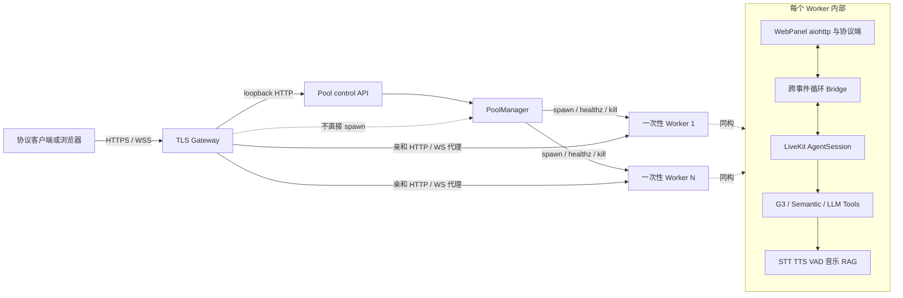
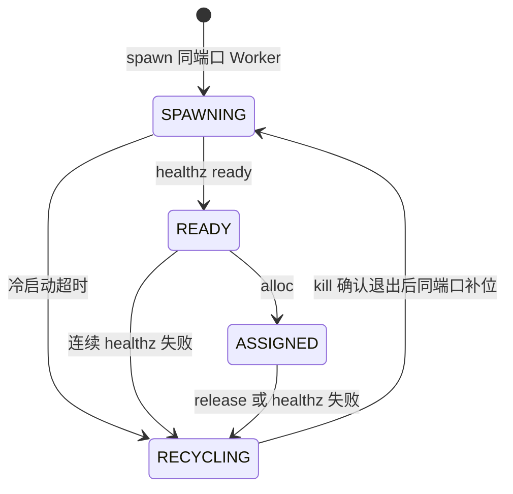
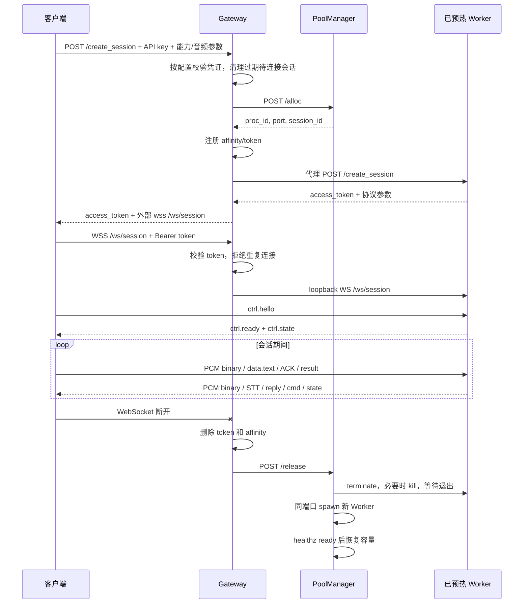
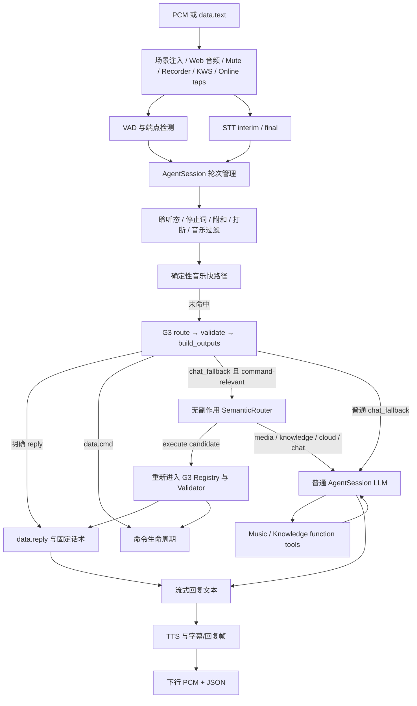
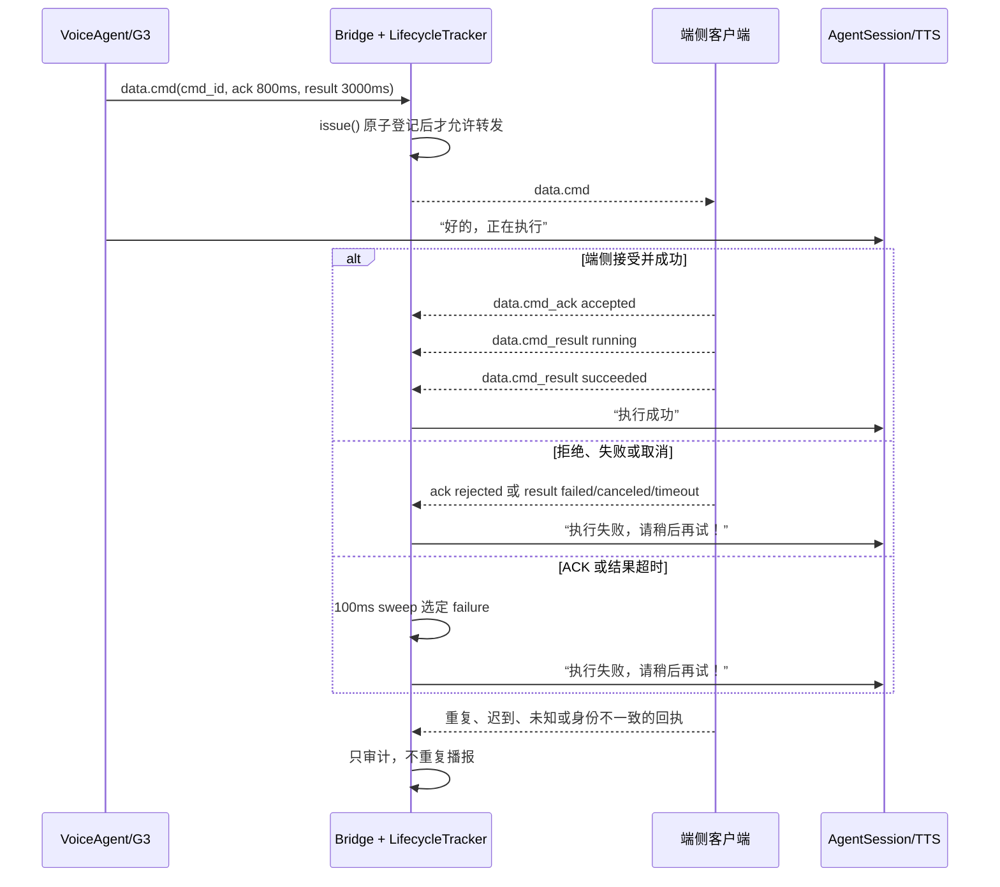

# 小歌 Duplex 当前系统架构

> 本文是面向开发、联调和排障的**当前实现总览**，覆盖云侧 Gateway、预热 Worker
> 进程池、R5.2.2 会话协议、LiveKit 语音管线、多域意图路由、控制指令闭环、音乐、
> 知识库和日志。运行命令与配置清单见 [RUN.md](RUN.md)，客户端协议细节见
> [CLIENT_INTEGRATION.md](CLIENT_INTEGRATION.md)，自有代码边界见
> [CODE_GUIDELINES.md](../project/CODE_GUIDELINES.md)。
>
> `docs/design/` 下的文档记录设计背景、评审过程或目标态；其中尚未落地的能力不能当作
> 当前运行事实。本文以仓库中的现有符号和可执行测试为准，刻意不依赖易漂移的行号。

---

## 1. 系统定位与边界

小歌是基于 LiveKit Agents 二次开发的中文全双工语音应用。当前系统同时支持两种入口：

1. **云侧协议入口（部署主路径）**：客户端通过 TLS Gateway 创建会话，再经合并的
   `/ws/session` 传输 JSON 控制帧和 16 kHz 单声道 int16le PCM。Gateway 把一条会话固定
   代理到一个预热 Worker。
2. **本地/浏览器调试入口**：直接运行 `web_ui_agent.py console`，由本地 WebPanel、
   `/ws`、`/ws/audio` 和 console 音频 I/O 服务开发调试。Gateway 仍保留这些旧入口的
   代理与浏览器重连宽限语义，但新协议客户端应优先使用 `/create_session` + `/ws/session`。

系统的核心职责分为五层：

| 层 | 当前职责 | 主要代码 |
| --- | --- | --- |
| 客户端/设备 | 采集 PCM、展示转写/回复、执行 `data.cmd`、回传 ACK/result | WebPanel 静态客户端或自研协议客户端 |
| TLS Gateway | 按配置执行 API key 准入、会话令牌、亲和、限流、HTTP/WS 反代、释放会话 | `examples/voice_agents/gateway/` |
| Pool Manager | 预热 Worker、状态机、健康检查、分配/回收、录音转码旁路 | `examples/voice_agents/poolmgr/` |
| 一次性 Worker | WebPanel 协议端、`AgentSession`、语音编排、业务路由、媒体和知识工具 | `web_ui_agent.py`、`webpanel/`、`app/`、`common/` |
| 模型与本地资源 | STT、TTS、普通对话 LLM、语义分类 LLM、VAD/EOU、音乐和向量索引 | `providers/`、`app/backends.py`、`app/knowledge_index.py` |

“Worker”在本仓库有两层含义，阅读时要区分：

- `poolmgr` 管理的 **OS Worker 进程**是 `web_ui_agent.py console` 的一次性实例；一条云会话
  用完后整个进程被回收。
- LiveKit 框架里的 `AgentServer`（旧称 Worker）负责 job/`AgentSession` 编排，它运行在
  上述 OS 进程内部。

---

## 2. 部署拓扑与组件职责



### 2.1 Gateway

`gateway.main._Router` 是外部路由入口：

- `/create_session`：按 Gateway 配置校验 API key（强制模式下缺失或错误即拒绝），分配 Worker，
  把请求代理到 Worker 的同名接口，记录 access token 与 `session_id` 的绑定，并把外部
  `ws_url` 改写为 Gateway 的 `/ws/session`。
- `/ws/session`：只接受 Bearer token；拒绝未知 token 和同一会话的重复连接；在一个 WSS
  中双向透传 JSON 与 PCM，并在连接结束后关闭亲和记录、调用 Pool `/release`。
- `/ws/audio`、`/ws`、`/api/*`：兼容浏览器/旧协议路径，使用 HMAC 亲和 cookie；
  `gateway.affinity.AffinityTable` 负责 `IDLE/ACTIVE/PENDING_DISCONNECT/CLOSED` 状态。
- `/knows`、`/api/knows/*`：按同一 API key 配置准入后从 `list_ready()` 选择任一 READY
  Worker，**不调用** `alloc()/release()`，因此知识管理不会占用会话或导致 Worker 被回收。
- `/healthz`：返回 Gateway 状态及 Pool 摘要。

`gateway.proxy.Proxy` 只做代理和连接生命周期，不做业务路由。它还实施每连接消息速率、
单帧大小限制。旧 `/ws/audio` 模式在浏览器短暂断线时保留上游并允许重接；宽限窗中未能
送达客户端的下行帧直接丢弃，不做重放。合并 `/ws/session` 则在断开后立即进入释放流程。

Gateway 只通过 `gateway.pool_client.PoolClient` 调本地控制 API，绝不直接创建 Worker。
Pool API 失败时采用安全默认：`alloc → None`、`release → False`、`status → {}`。

### 2.2 Pool Manager 与一次性 Worker

`poolmgr.launcher` 根据 `XG_POOL_*` 配置构建 `PoolManager`、转码器和仅绑定 loopback 的
控制 API。控制面只有四个操作：`/alloc`、`/release`、`/status`、`/list_ready`。

每个进程槽位遵循：



关键语义：

- Pool 大小 `N` 是理想状态下可立即分配的会话数，不是排队容量。
- `alloc()` 只取 READY Worker，并把 `session_id` 设为该一次性进程的 `proc_id`。
- `release()` 不把 Worker 简单复位，而是回收整个进程，避免上一会话的全局状态、模型流、
  音频缓冲或工具状态泄漏到下一会话。
- `_recycle()` 在锁内只移除状态并调度 reaper；`kill/wait` 在锁外执行。
- `_reap_work()` 必须先确认旧进程退出、端口释放，再在同端口 spawn；录音目录也只在进程
  收尾后交给转码器，避免端口抢占和录音写入竞态。
- SPAWNING 期间普通 healthz 失败不会按“连续失败”误杀；只有越过 spawn timeout 才回收。

回收和冷启动期间该槽位不 READY，所以瞬时可用容量会下降。Pool 满时，当前 Gateway 在清理
待连接会话后每 250 ms 重试分配，最长约 15 秒，之后返回 503 `resource_exhausted`。

### 2.3 Worker 内部

一个 Worker 主要包含：

- `AgentServer`/console 执行器与一个 `AgentSession`；
- 独立线程和事件循环上的 WebPanel aiohttp 服务；
- `webpanel.server` 的 `/create_session`、`/ws/session`、旧 Web 页面和管理 API；
- `webpanel.bridge`，在 Agent loop 与 Web loop 之间传消息；
- STT/TTS/VAD/EOU、KWS、在线打断、录音和实时字幕 tap；
- `VoiceAgent` 的确定性路由、语义兜底以及普通 LLM tools；
- 每 Worker 的 `MusicPlayer`，以及从共享持久化文件加载的 `KnowledgeIndex`。

Pool 启动时为 Worker 注入 loopback host/port、会话标识、录音模式、审计级别和部署目录下的
日志路径。生产池默认隐藏 ASR/TTS 管理路由并关闭 native KWS，避免外部管理面和服务端误唤醒。

---

## 3. 云会话的控制流

### 3.1 创建、建连、释放和补位



创建会话的几个边界：

- 根页面本身不占 Pool；只有 `/create_session` 或兼容协议的直接 `/ws/audio` 才分配。
- Worker 的 `/create_session` 仍会校验设备标识、客户端版本、能力集合以及 16 kHz、单声道、
  int16le 等协议约束；Gateway 不是唯一校验层。
- Gateway 返回给客户端的 token 只映射到已分配会话；同一会话只允许一条活跃
  `/ws/session`。
- 创建后长期不建 WS 的 token 会被清理；资源紧张时当前实现还会强制清理所有待连接会话，
  因而客户端应拿到 token 后立即建连。
- `/ws/session` 关闭即释放一次性 Worker。旧浏览器 `/ws/audio` 才使用 cookie 重连宽限窗。

### 3.2 合并 WebSocket 帧流

`/ws/session` 同时承载：

- **上行二进制**：16 kHz、mono、int16le PCM；
- **下行二进制**：TTS 或音乐 PCM；
- **上行 JSON**：`ctrl.hello`、`ctrl.frontend_state`、`data.text`、`data.cmd_ack`、
  `data.cmd_result`；
- **下行 JSON**：`ctrl.ready`、`ctrl.state`、`data.stt`、`data.reply`、`data.cmd` 等。

Gateway 对客户端上行文本只验证合法 JSON，并实施帧大小和速率限制；具体 schema、命令身份和
状态机由 Worker 处理。完整字段以 [R5.2.2 JSON Schema](../g1_contract_signoff_package_r21_r5_2_2_20260804/02_contracts/xiaoge-duplex-protocol-r5.2.2.schema.json)
和 [CLIENT_INTEGRATION.md](CLIENT_INTEGRATION.md) 为准。

---

## 4. 一轮语音的数据流



### 4.1 音频识别与判停

`entrypoint()` 通过 `setup_stt()` 选择主 STT，并构建：

- Silero VAD（在 `prewarm()` 中加载）；
- `MultilingualModel` 语义判停；
- `AgentSession` 的 endpointing、打断和 preemptive generation 配置；
- 可热切换的 `SwitchableSTT`/`SwitchableTTS`（具体适用范围取决于 STT 栈）；
- 实时字幕、录音、KWS、在线 ASR 打断、音乐等 tap。

默认 upstream 栈中，非流式 STT 通过 `StreamAdapter` 用 VAD 切出整段后识别；optimized
FunASR 2-pass 和讯飞流式后端绕过该适配器。非流式路径必须等到语音段结束，因而其结构性
延迟高于真正流式 STT。`preemptive_generation` 会尝试把 LLM/TTS 首包计算与判停窗口重叠。

### 4.2 打断与轮次过滤

当前打断来源互补：

| 来源 | 作用 | 失败/降级方式 |
| --- | --- | --- |
| LiveKit VAD 打断 | 内容无关的通用 barge-in | 核心路径 |
| native KWS | 本地快速识别“停/别说了”等 | 缺依赖或模型时 no-op；生产池默认关闭 |
| online interrupt ASR | AI 播报时按识别文本提前打断 | 网络异常后重连，不作为主转写 |
| final STT 文本规则 | 停止词与附和兜底 | 最慢但始终可参与 |

`VoiceAgent.on_user_turn_completed()` 的实际顺序不是“直接把转写交给 LLM”，而是：

1. 聆听模式吞入、退出尾巴与整理请求；
2. 连续对话确认和自动进入聆听态；
3. 确定性音乐播放/停止/恢复；
4. 停止词、当前音乐状态、附和与 overlap ACK 过滤；
5. G3/semantic 业务路由；
6. 未被消费的轮次才进入普通 LLM；
7. 必要时做口述数字归一化。

音频 tap 是承载链：输入 tap 必须把帧继续返回，输出 tap 必须透传 `flush()` 和
`clear_buffer()`，否则可能导致下游“变聋”或打断后仍继续播放。框架在不可打断播报或 AEC
预热期间还可能让 VAD 收帧但跳过 STT；排查“VAD 在动却没有转写”时应优先检查这一点。

### 4.3 文本输入

`data.text` 经 `VoiceAgent.handle_manual_text()` 进入同一套音乐过滤、G3 与 semantic 路由；
若未被确定性路径消费，再调用 `AgentSession.generate_reply()`。它与真实音频共享业务安全边界，
但不完全等同于一个由 STT 产生的标准 conversation item，见 §11 的 QA 日志限制。

---

## 5. 意图识别与多域路由

### 5.1 路由优先级

当前优先级是有意设计的仲裁顺序：

1. **会话/聆听/停止词/附和过滤**：决定该轮是否应被吞掉或只用于打断；
2. **确定性音乐语音快路径**：播放、停止、恢复直接操作共享 `MusicPlayer`；
3. **G3 确定性路由**：言语行为安全门、命令 Registry、槽位抽取、查询/知识模板；
4. **SemanticRouter 兜底**：只处理 G3 `chat_fallback` 且仍有 command-relevant 特征的文本；
5. **普通 AgentSession/LLM**：聊天以及被 semantic 判定为 media/cloud/knowledge/chat 的委托；
6. **LLM function tools**：当前主要是音乐与真实向量知识库。

越靠前的路径越确定、越低延迟；越靠后的路径泛化更强，但不能绕过控制授权边界。

### 5.2 G3 是控制指令的唯一权威

`common.g3_intent.G3IntentEngine` 把控制能力收敛到 `RegistryEntry`：

- `action`/`capability_id`；
- 参数 schema、枚举、范围和必填项；
- 风险级别；
- 允许的 delivery；
- 确定性 matcher/extractor 和示例。

执行链固定为：

```text
route(text, state)
  → validate(intent, state)
  → build_outputs(validation, state)
  → data.cmd 或 reply-only data.reply
```

Validator 检查单命令策略、`cmd` capability、必填槽位、类型/范围、额外槽位、风险确认和
当前 engine gate。`build_outputs()` 只有在 `intent_type == control_cmd`、验证接受且 delivery
可执行时才能生成 `data.cmd`。普通工具调用不能调用 `send_data_cmd`；`function_call_output()`
会拒绝任何试图直接发送命令的函数结果。

### 5.3 先判断言语行为，再识别动作

动作词出现不等于立即执行。G3 在动作匹配前识别非执行言语行为：

| 用户表达 | 识别 | 当前结果 |
| --- | --- | --- |
| “请向前走一米” | 立即执行 + robot control | 进入 Registry/Validator |
| “你能向前走吗” | capability query | 只回复能力，不生成 `cmd_id` |
| “不要向前走” | prohibit | 只回复，不执行 |
| “如果前面有人你会走吗” | hypothetical | 只回复，不执行 |
| “等会儿向前走” | future plan | 只回复，不执行 |
| “他说‘向前走一米’” | quotation | 只回复，不执行 |
| “向前走一米再挥手” | multi command | 要求拆分，不批量下发 |

这种“speech act → domain/action”的拆分解决了仅按关键词把能力询问误当控制的问题。

### 5.4 SemanticRouter：泛化层，不是执行层

`common.semantic_router.SemanticRouter` 使用独立、低温、短超时的 LLM 产生严格 schema：

- `speech_act`；
- `domain`；
- Registry 中的 `action`；
- 受限 `slots`；
- `confidence`、`ambiguous`、`answer_mode`。

它具有以下硬边界：

- 调用时 `tools=[]`，不能执行工具或产生副作用；
- 不能创建 `cmd_id`，也没有协议广播权限；
- Pydantic 使用 strict schema 和 `extra="forbid"`；
- 只接受“立即执行 + robot_control + 非歧义 + 高于阈值 + 已注册 action + 合法槽位”；
- 被接受的结果仍通过 `G3IntentEngine.semantic_candidate()` 重新进入确定性 Validator；
- 超时、HTTP 错误、非法 JSON/schema、低置信度、歧义、未知 action、额外槽位全部 fail closed；
- `shadow` 模式只记录判断，不改变路由；`off` 完全关闭。

因此语义模型提高的是自然表达的召回率，而不是扩大控制权限。对于 semantic 判断为
media、knowledge、cloud 或 chat 的非执行轮次，系统把它交还普通 LLM/tool 链，而不是由分类
模型回答。

### 5.5 各业务域如何串联

| 业务域 | 入口与实现 | 输出/合流点 |
| --- | --- | --- |
| 指令控制 | G3 Registry 快路径；未决且 command-relevant 时可由 SemanticRouter 提候选，再经 G3 校验 | `data.cmd` → lifecycle；或固定 `data.reply` |
| 音乐 | 确定性语音快路径；普通 LLM 的 `play_music`/`stop_music` tool | 两路共享一个 `MusicPlayer` 和同一 WS 音频输出 |
| 产品知识 RAG | 普通 LLM 调 `query_knowledge`，查询真实 `KnowledgeIndex` | 命中块作为 LLM 上下文，再自然语言播报 |
| G3 模板知识 | `_looks_like_knowledge()` → `knowledge_route` → `_rag_answer()` | 直接模板 `data.reply`，不是向量检索 |
| 状态/信息查询 | G3 `info_query`/`cloud_tool_route` | 当前多为模板回复，真实设备状态覆盖有限 |
| 普通聊天 | 前述路径均未消费 | 常规 LLM 流式生成 → TTS/字幕 |

需要特别注意：G3 的 `_rag_answer()` 名字虽然带 RAG，但当前只是少量模板回答；真实向量 RAG
位于 `app.knowledge_index.KnowledgeIndex`，通过 `query_knowledge` tool 使用。由于 G3 路径优先，
两条知识路由目前有覆盖重叠，不能把所有 `knowledge_qa` 都理解成已调用向量库。

---

## 6. 指令控制闭环

### 6.1 协议与用户话术



当前 G3 在命令帧中设置：

- `ack_timeout_ms = 800`；
- `result_timeout_ms = 3000`；
- 唯一 `cmd_id`，以及 `trace_id/session_id/utterance_id` 身份组。

`webpanel.bridge` 在转发前调用 `CommandLifecycleTracker.issue()`；重复 issue 不会二次下发。
Worker 收到 `data.cmd_ack`/`data.cmd_result` 后调用 `accept_update()`，只有第一次选出的终态 outcome
可以触发用户话术。成功对应“执行成功”；拒绝、失败、取消、协议 timeout、ACK timeout 或结果
超时统一对应“执行失败，请稍后再试！”。

### 6.2 exactly-once 终态语义

`CommandLifecycleTracker` 以锁保护 record 与审计事件，处理：

- 未知 `cmd_id` 或 trace/session/utterance 身份不一致 → `unknown`；
- 相同状态重放 → `duplicate`；
- 终态后冲突更新或超时后到达 → `late`；
- `running` 只更新中间态，不播报终态；
- `succeeded` 只选一次 success；
- `failed/canceled/timeout` 或 deadline 只选一次 failure。

这里的 exactly-once 指**单 Worker 生命周期内用户终态播报至多一次**，不是跨进程持久化事务。
Worker 回收后内存 record 不保留；协议客户端也不应在新会话重放旧命令回执。

---

## 7. 音乐、RAG、聊天和查询

### 7.1 音乐

`app.music_player.MusicLibrary` 缓存扫描 `.mp3/.wav`，按随机、精确曲名、子串、
`SequenceMatcher` 模糊匹配解析。`MusicPlayer` 用一个实时节流 task 解码并每 10 ms 推 PCM：

- WAV 可直接解码，其他情况/MP3 通过 ffmpeg；
- 复用 `WebSocketAudioOutput`，不建立第二条媒体连接；
- TTS speaking 时暂停音乐，新播报结束后恢复；若状态回调丢失，有兜底 timer；
- stop 取消 task，并只清音乐缓冲，避免破坏其他音频；
- 确定性语音快路径和 LLM tools 操作同一个 player。

当前策略是：音乐播放期间，非音乐用户轮次会被吞掉而不进入聊天，以避免音乐场景下的串音和
并发回复。这是明确的产品策略/限制，不是通用多任务对话能力。

### 7.2 真实向量 RAG

`KnowledgeIndex` 的路径为：

```text
Markdown 语料
  → 按一级标题与长度切块
  → DashScope text-embedding-v3（每批最多 10 条）
  → vectors.npy + knowledge.db + meta.json
  → 查询向量与文档向量余弦相似度
  → top_k + min_score
  → KnowledgeHit 列表
  → query_knowledge tool
  → 普通 LLM 组织一到三句口语回复
```

索引在 Worker 启动时 best-effort 加载；没有持久化索引时不阻止 Worker READY，工具会明确返回
未启用/未命中而不编造。`meta.json` mtime 变化会触发查询前热加载。`/knows` 管理路径可追加、
列出、删除用户知识并 rebuild；多个 Worker 通过共享文件和 mtime 感知更新。

### 7.3 普通聊天与工具

只有未被前置确定性路径消费的轮次才进入 `AgentSession` 的普通 Qwen LLM。LLM 可调用已注册的
音乐和知识工具，但没有直接创建 `data.cmd` 的工具。流式文本先经 `transcription_node()` 广播
干净字幕，再经 `tts_node()` 去 Markdown 后合成音频。

### 7.4 查询能力的当前边界

- 产品知识查询已有真实向量 RAG，但可能被更早的 G3 模板知识路由截获。
- `power.query`、泛化 `info_query` 等 G3 查询当前主要由 `_info_answer()` 生成固定回复。
- SemanticRouter 的 `state_query/cloud_tool` 只是分类与委托信号，不代表已经接入完整设备状态 API。
- 因此“查询”不能笼统描述成实时读取机器人状态；新增真实查询后端时，应保持 reply-only 与
  command authority 分离。

---

## 8. STT、TTS 与全双工基础设施

### 8.1 后端装配

`app.backends` 是 STT/TTS 注册表和 LLM 工厂的主要入口：

| 能力 | 当前实现 |
| --- | --- |
| 普通 LLM | OpenAI-compatible Qwen client，关闭 thinking，普通对话温度 |
| 语义 LLM | 独立 client，温度 0、短 timeout、小 token 上限、无 tools |
| STT | FunASR offline、Qwen3 offline/stream 等注册后端；另有 optimized FunASR/讯飞流式栈 |
| TTS | CosyVoice、Qwen、HTTP streaming，可通过 `SwitchableTTS` 切换 |
| VAD/EOU | 本地 Silero VAD + Multilingual turn detector |

增加注册式 STT/TTS 后端时，在 `providers/` 实现统一接口，并更新 `app.backends.STT_BACKENDS`
或 `TTS_BACKENDS`。是否能在当前会话热切换取决于它是否经过 `SwitchableSTT/TTS`；optimized
流式 STT 不走 `SwitchableSTT`，切换需重启。

### 8.2 性能与失败语义

主要低延迟手段包括持久/预热 ASR 连接、流式或按句 TTS、preemptive generation、LLM 关闭
thinking、连接池和短 endpointing。实际端到端耗时仍由 VAD 静默窗、STT final、EOU、LLM TTFT、
TTS TTFB 和播放调度共同组成，不能只看模型接口耗时。

外部语义 LLM 超时或 5xx 不会放行控制；知识 embedding/索引缺失不会阻止会话启动；可切换 STT
后端异常按空结果降级，避免杀死整条识别流。故障是否“可恢复”应按各适配器和测试契约判断，
不能假设所有外部模型都有相同重试策略。

---

## 9. 线程、事件循环与旁路

部署 Worker 不是单线程单循环。关键执行边界如下：

| 执行单元 | 主要工作 | 跨界方式 |
| --- | --- | --- |
| Gateway asyncio loop | 外部 HTTP/WSS、代理 pump、token/affinity | aiohttp task |
| Pool control/manager | 控制 API、Pool 状态和 poll thread | `RLock` + reaper daemon thread |
| LiveKit job loop | `AgentSession`、路由、STT/TTS 协程、tools | Worker 内主业务 loop |
| WebPanel loop | Worker-local HTTP/WS、协议解析、timeout sweep | 独立 daemon thread + loop |
| Agent ↔ Web bridge | 下发帧、状态和手工文本 | `run_coroutine_threadsafe` / `call_soon_threadsafe` |
| KWS/SDK/音频线程 | sherpa 解码、同步 SDK、PortAudio 回调 | queue/event + thread-safe callback |
| QA writer | JSONL 批量追加 | 有界 queue + daemon thread |
| 录音/ffmpeg | 文件收尾、音乐/转码子进程 | `to_thread` 或 subprocess |

两条纪律必须保持：

1. 不在 WebPanel loop 直接 `await` 属于 Agent loop 的协程；
2. 不在 PoolManager 锁内做 `kill().wait()`、网络调用或长时间文件操作。

`webpanel.bridge.broadcast()` 在 Web loop 尚未就绪时可能 no-op；控制指令以它的布尔返回判断是否
真正登记并下发，失败时播报执行失败而不是假装已执行。

---

## 10. 安全边界与关键不变量

### 10.1 外部与内部网络边界

- Gateway 是唯一外部 TLS 入口；Pool control API 和 Worker WebPanel 端口只绑定 loopback。
- `/create_session`、无 cookie 的直接协议 `/ws/audio` 和 `/knows` 都经过 `ApiKeyStore`；
  `XG_API_KEY_REQUIRED=1` 时必须命中有效 key，兼容/观察模式下则记录但放行。浏览器页面入口
  可另外启用访问口令。
- 亲和 cookie 使用 HMAC，并设置 HttpOnly、SameSite；TLS 下设置 Secure。
- access token 绑定一个已分配会话；重复 `/ws/session` 被拒绝。
- Gateway 限制消息速率和帧大小，错误响应避免返回内部端口/进程拓扑。

### 10.2 业务不变量

1. **一条云会话独占一个一次性 Worker**，会话结束后回收进程而非复用内存状态。
2. **Gateway 不直接 spawn**；Pool Manager 是进程生命周期唯一所有者。
3. **同端口补位必须在旧进程确认退出后发生**。
4. **G3 Registry + Validator 是 `data.cmd` 的唯一授权边界**。
5. **SemanticRouter 和普通 LLM 都不能直接发命令**。
6. **P0 一轮只允许一个控制动作**；多动作要求用户拆分。
7. **reply-only 意图永远不创建 `cmd_id`**。
8. **命令终态对用户至多播报一次**；未知、重复和迟到回执只审计。
9. **音乐两种入口共享同一个 player**，避免重复媒体状态机。
10. **知识管理不走 alloc/release**，避免管理请求清空 Worker Pool。
11. **部署日志路径由 Worker 启动环境决定**，不能被复制来的 `.env` 改到其他部署。
12. **失败默认不扩大权限**：Pool/semantic/schema/capability 失败都不应转化成控制执行。

### 10.3 高风险命令

Registry 已为 reboot/shutdown 等动作定义“确认后下发”。但当前 `VoiceAgent` 每轮新建的
`SessionState` 没有持久保存 `pending_high_risk`，因此跨轮确认闭环尚不完整；当前运行效果通常是
先要求确认，但下一轮无法恢复待确认命令。补齐前不能把高风险确认描述为已完整落地的安全能力。

---

## 11. 配置、日志与可观测性

### 11.1 配置

根 `.env` 是应用配置入口，`.env.example` 是变量清单。`env_bootstrap.py` 在自有模块 import 前
调用 `load_dotenv(..., override=True)`，所以部署启动器需要对不可被复制 `.env` 覆盖的值使用更高
优先级变量。

配置域大致分为：

- `XG_*`：Gateway、Pool 大小/端口/转码等部署控制；
- `XIAOGE_*`：语义路由、录音、KWS、知识库、音乐和会话行为；
- `QWEN_*`、`DASHSCOPE_*`、各 ASR/TTS URL：模型后端；
- `TURN_*`：VAD、endpointing、打断和抢先生成；
- `WEB_UI_*`：Worker-local WebPanel。

实际名称和默认值应从 `.env.example`、`gateway.config.GatewayConfig`、
`poolmgr.launcher.PoolLaunchConfig` 及相应 `from_env()` 读取，不在架构文档复制完整清单。

### 11.2 日志与录音

- `TURN_METRICS_LOG`：按 Worker/进程标识区分的轮次指标日志；
- `QA_LOG`/`XIAOGE_DEPLOY_QA_LOG`：每个部署共享一个基名，按本地日期生成
  `<基名 stem>_YYYYMMDD<原后缀>`（默认是 `qwen_voice_qa_YYYYMMDD.log`）；文件内容为
  JSONL，记录可含 `process` 字段区分 Worker；
- `QAPairLog`：按正常 `AgentSession` conversation item 将 final user 与后续 assistant 配对；
- timeline/recording：按运行配置写审计事件和会话录音，进程退出后再转码。

`poolmgr.manager.default_agent_env()` 同时注入 `QA_LOG` 与优先级更高的
`XIAOGE_DEPLOY_QA_LOG`。这是为了抵抗 `load_dotenv(override=True)` 从复制部署读到陈旧路径，保证
不同部署不会共同写入另一个目录。

限制：手工 `data.text` 的确定性快路径可以直接广播/`session.say()`，未必形成普通
AgentSession user/assistant item 对，因此当前不能保证每个手工文本轮次都进入 QA 配对日志。

---

## 12. 当前限制与技术债

| 项 | 当前影响 |
| --- | --- |
| Pool 耗尽 | Gateway 最长等待约 15 秒后 503；没有持久排队或预约机制 |
| 一次性 Worker 冷启动 | release 后到替补 READY 期间可用容量下降 |
| 待连接会话抢占 | 资源紧张时 forced cleanup 可能释放已创建但尚未建 WS 的会话 |
| 外部 semantic 服务 | 可能 5xx/timeout；当前安全降级，但自然指令召回下降 |
| 高风险确认 | `pending_high_risk` 尚未跨轮持久化，确认闭环不完整 |
| 两套知识路由 | G3 模板知识可能先于真实向量 RAG 命中，行为不统一 |
| 状态/云查询 | 多数仍是模板或委托信号，真实设备状态 API 覆盖不足 |
| 音乐中对话 | 非音乐轮次被吞掉，不支持边播音乐边正常聊天 |
| QA 配对 | 手工 `data.text` 快路径不保证产生标准 conversation item |
| Worker 编排复杂度 | `web_ui_agent.py` 仍聚合较多跨域仲裁，新增域需谨慎维护优先级 |
| 内存态 exactly-once | 命令 record 不跨 Worker 持久化，不是分布式事务语义 |
| 旧/新协议并存 | `/ws/audio` cookie 宽限与 `/ws/session` 即断即释放语义不同，联调时易混淆 |

这些是当前事实边界。目标态讨论可参考
[DUPLEX_CONTROL_QUERY_ARCHITECTURE.md](../design/DUPLEX_CONTROL_QUERY_ARCHITECTURE.md)，但实施前仍须
重新对照当前代码和协议契约。

---

## 13. 面向任务的代码阅读路线

### 13.1 主线阅读顺序

1. **外部入口与会话所有权**
   - `examples/voice_agents/gateway/main.py`：`create_session()`、`_serve_ws_session()`、
     `knows_api()`、`_sweep_loop()`；
   - `gateway/affinity.py`：`Session`、`AffinityTable`；
   - `gateway/proxy.py`：`handle_ws_session()`、旧音频重连 pump。
2. **Pool 与一次性进程**
   - `poolmgr/launcher.py`：生产配置和启动；
   - `poolmgr/manager.py`：`alloc()`、`release()`、`_recycle()`、`_reap_work()`、`poll_once()`；
   - `poolmgr/control_api.py`：Gateway/Pool 职责边界。
3. **Worker 协议入口与跨循环桥**
   - `webpanel/server.py`：Worker `/create_session`、`/ws/session` 和协议帧处理；
   - `webpanel/bridge.py`：`broadcast()` 与 `data.cmd` 登记/转发。
4. **语音应用编排**
   - `web_ui_agent.py`：`entrypoint()`、`VoiceAgent.on_user_turn_completed()`、
     `_apply_turn_filters()`、`_g3_frames()`、`_semantic_frames()`；
   - `app/setup_taps.py`：session events 和 tap 装配。
5. **意图与控制授权**
   - `common/g3_intent.py`：Registry、`route()`、`validate()`、`build_outputs()`；
   - `common/semantic_router.py`：严格 schema、LLM 调用与 fail-closed 分类。
6. **业务工具**
   - `app/music_player.py`、`app/knowledge_index.py`、`app/backends.py`；
   - `web_ui_agent.VoiceAgent.play_music()`、`stop_music()`、`query_knowledge()`。
7. **命令闭环和协议契约**
   - `webpanel/command_lifecycle.py`；
   - R5.2.2 schema 和 §14 的测试。
8. **底层语音框架（需要时）**
   - `livekit-agents/livekit/agents/voice/agent_session.py`；
   - `voice/agent_activity.py`、`voice/audio_recognition.py`；
   - `stt/stream_adapter.py`。

### 13.2 最短排障路径

| 问题 | 优先阅读/检查 |
| --- | --- |
| `/create_session` 慢或 503 | `gateway.main.create_session/_alloc_after_cleanup` → Pool `/status` → `PoolManager.poll_once/_reap_work` → Worker healthz/启动日志 |
| WS 建连后立即断 | Gateway token/duplicate 分支 → `gateway.proxy.handle_ws_session` → Worker `webpanel.server` Bearer/schema 校验 |
| VAD 在动但没有识别 | `setup_stt`/主 STT → tap 是否透传 → `AgentActivity.push_audio` 的 skip/discard → 后端连接日志 |
| 自然指令未识别 | `_apply_turn_filters` → G3 `route()` → `command_relevant()` → SemanticRouter 状态/阈值/timeout → `semantic_candidate()` |
| 能力询问误执行 | G3 `_non_execution_act()` 与 `build_outputs()` 的 `intent_type` 守卫 → semantic speech_act |
| 命令已下发但没结果播报 | bridge `issue()` → 端侧 ACK/result 身份组 → `CommandLifecycleTracker` audit → Worker 100ms timeout sweep |
| RAG 没结果 | 是否被 G3 模板先截获 → `query_knowledge` 是否调用 → `KnowledgeIndex.is_ready/_load/query` → embedding key、索引 mtime、min_score |
| 音乐找不到或不出声 | `_music_control_intent` → `MusicLibrary.resolve` → ffmpeg/WAV 解码 → TTS pause/resume → Web audio output |
| 日志写到错误部署 | Worker 环境中的 `XIAOGE_DEPLOY_QA_LOG` → `common.qa_log.QA_LOG` → `default_agent_env()` 推导的 run_dir |
| 手工文本无 QA 记录 | `handle_manual_text()` 是否走确定性快路径 → `setup_taps` conversation item handlers → `QAPairLog` |

---

## 14. 可执行架构契约

静态文档只解释设计；以下测试锁定当前关键行为，改架构时应同步阅读和运行：

| 契约 | 代表测试 |
| --- | --- |
| Pool 状态机、锁外回收、同端口补位、部署日志 env | `tests/test_ours_concurrency_b_manager.py` |
| Pool 控制 API 与 Gateway client 安全默认 | `tests/test_ours_concurrency_b_control_api.py`、`test_ours_concurrency_c_poolclient.py` |
| affinity、代理和 Gateway 会话集成 | `tests/test_ours_concurrency_c_affinity.py`、`test_ours_concurrency_c_proxy.py`、`test_ours_concurrency_c_main.py`、`test_ours_concurrency_d_integration.py` |
| Pool 启动配置 | `tests/test_ours_concurrency_poolmgr_launcher.py` |
| G3 控制/查询/RAG 模板与言语行为 | `tests/test_ours_g3_intent_command_rag.py`、`test_ours_g3_x3_skill_commands.py` |
| SemanticRouter schema、阈值和 fail closed | `tests/test_ours_g3_semantic_router.py` |
| R5.2.2 WS 与命令 ACK/result/timeout | `tests/test_ours_g3_ws_session_protocol.py` |
| 音乐解析、播放与在线打断协调 | `tests/test_ours_music_player.py`、`test_ours_music_voice_controls.py`、`test_ours_online_interrupt_music.py` |
| 向量知识库 | `tests/test_ours_knowledge.py` |
| QA JSONL 与部署路径优先级 | `tests/test_ours_qa_log.py` |

常用命令见 [RUN.md](RUN.md) 和仓库根 `AGENTS.md`；本仓库统一使用 `uv`。文档改动至少应执行
链接/路径检查和 `git diff --check`，运行时代码改动还应选择上述聚焦测试，并按
[CODE_GUIDELINES.md](../project/CODE_GUIDELINES.md) 运行自有代码检查。

---

## 15. 相关文档

- [运行指南](RUN.md)：安装、配置、启动和运维命令；
- [客户端接入](CLIENT_INTEGRATION.md)：R5.2.2 WS 端点、音频和消息协议；
- [自有代码规范](../project/CODE_GUIDELINES.md)：包职责、文件/函数规模和检查命令；
- [全双工 + 控制 + 查询设计背景](../design/DUPLEX_CONTROL_QUERY_ARCHITECTURE.md)：目标态和设计原则，
  **不是当前实现清单**；
- [指令技能设计](../design/command-auth/COMMAND_SKILLS_DESIGN.md) 与
  [运行时补充规格](../design/command-auth/COMMAND_SKILLS_RUNTIME_SPEC.md)：评审/设计背景；
- `examples/voice_agents/qwen_voice_agent_code_guide.md`：LiveKit 语音内核源码导读。

`docs/diagrams/architecture.svg` 与 `sequence-turn.svg` 是早期本地语音架构快照，可用于理解基础
语音链路；云 Gateway、Pool、G3/Semantic 与命令闭环以本文内嵌 Mermaid 和当前代码为准。
